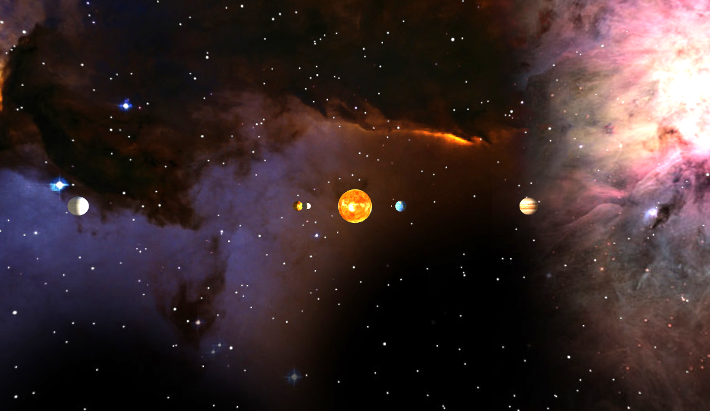

# (Lite) Solar System modelisation, using WebGL + JavaScript

WebGL implementation for a simplified Solar System, coded in javascript.

# Languages & technologies

- WebGL
- JavaScript
- HTML/CSS

# Live Demo

See: [http://colinleverger.github.io/solar-system-webgl/](http://colinleverger.github.io/solar-system-webgl/)

Deployed in gh-pages thanks to Travis CI.

